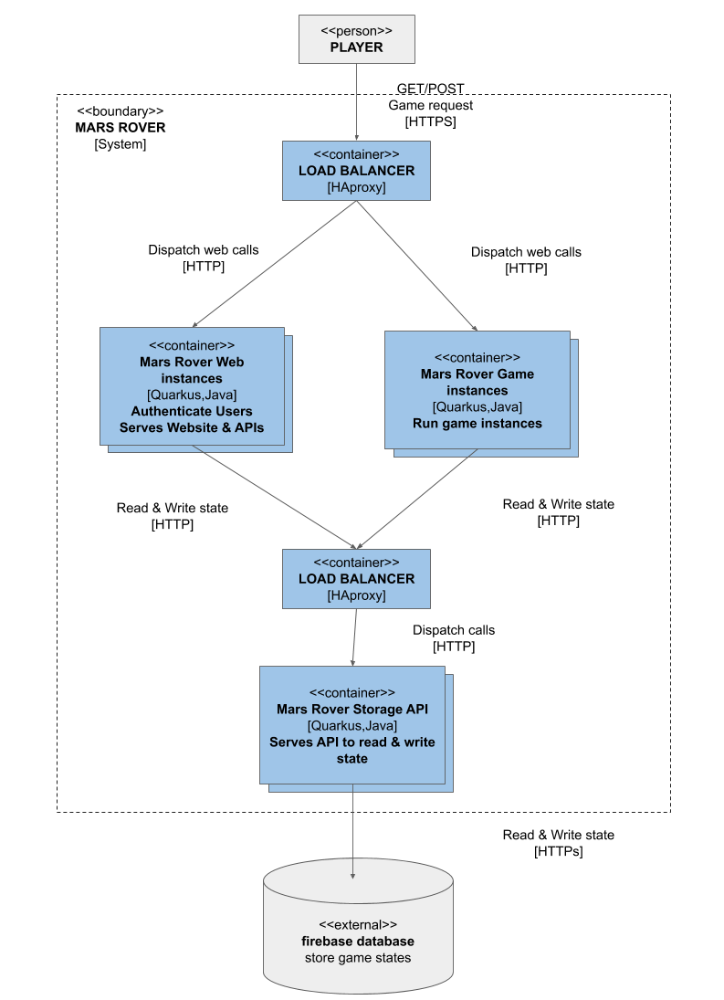

# Conception du Système

**Est-ce que les joueurs interagiront en temps réel, ou au tour par tour et pourquoi ?**
Les joueurs interagiront au tour par tour. Car l'interaction dans un jeu en temps réel avec un serveur est beaucoup plus complexe.

**Comment sera stocké l'état (toutes les données permettant de représenter le jeu) ?**
L’état du jeu (données permettant de représenter le jeu) sera stocké dans une base de données.

Une table player contenant les informations d’un joueur:
 - ID 
 - NAME
 - EMAIL
 - PASSWORD

Une table game contenant les informations d’une partie:
 - ID
 - MAP_SIZE
 - OBSTACLES

Une table game_status responsable des informations de chaque joueur dans chaque partie:
 - PLAYER_ID
 - GAME_ID
 - POSITION_X
 - POSITION_Y
 - DIRECTION
 - LASER_RANGE
 - RADAR_RANGE
 - IS_PLAYING
 - IS_ALIVE

**Comment seront stockées les informations confidentielles des joueurs (emails, etc.)**
Les informations des joueurs seront chiffrées à l’aide d’un salt unique en base afin de garantir leur confidentialité.

**Comment gérer plusieurs parties en même temps ?**
Le système pourra générer plusieurs instances d’un jeu dans des processus parallèles.
Si le nombre devient trop important, les joueurs seront redirigé vers un nouveau conteneur.

**Comment gérer plusieurs parties par joueurs en même temps ?**
Les joueurs ont un ID propre ainsi que les parties.
Un joueur pourra donc faire une requête vers la bonne partie en fonction de l’ihm requête.

**Que se passera-t-il si un serveur plante ? (considérer la machine / vm / conteneur éteint(e) et inaccessible)**
Si un conteneur plante le load envoyer redirigera les requêtes vers un nouveau conteneur créé.

**Comment les joueurs s'authentifient et sauvegardent leur progression ?**
Les joueurs s'authentifient avec leurs noms et mot de passe. Ce nom sera chargé dans l’API du jeu.
Si le nom d’un joueur n’est pas déjà dans le dictionnaire, il sera ajouté. 

**Comment gérer une charge imprévue ? (100x plus de joueurs que prévu par ex)**
Si une charge imprévue est en cours le serveur devra avoir suffisamment de puissance pour générer assez de conteneur pour supporter la charge.
Dans le cas contraire, une architecture cloud pour redimensionner le nombre de conteneur en fonction de la charge.

Diagramme de l'architecture du système

